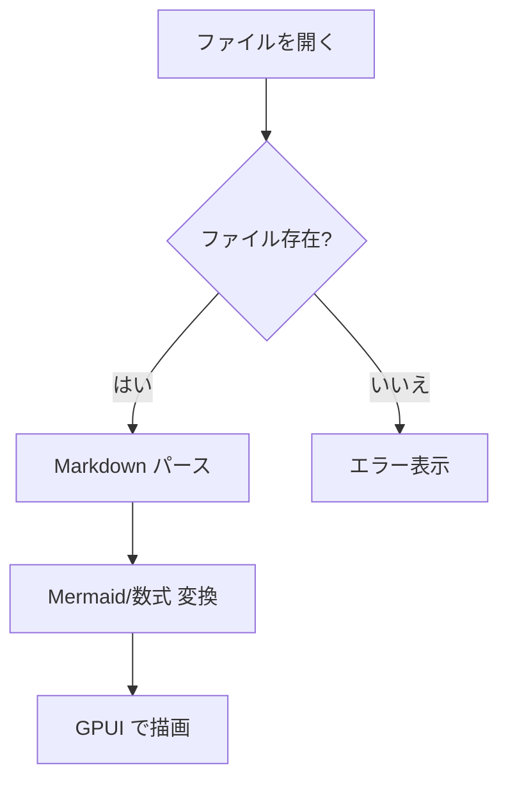
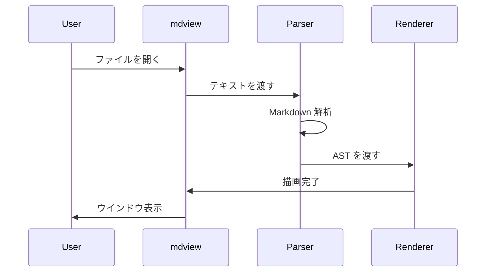
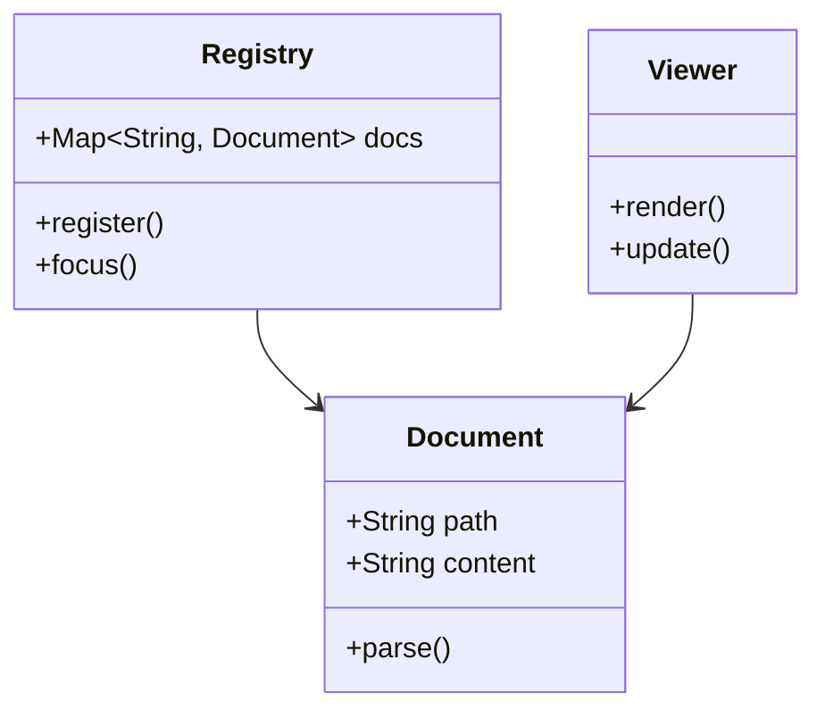

# mdview

Ultra-simple read-only Markdown viewer for Windows 11, built with Rust + [GPUI](https://github.com/zed-industries/zed/tree/main/crates/gpui).

Windows 11 / x64 向けの、極力小さく単純な読み取り専用 Markdown ビューワーです。

## 特徴

- 編集機能なし ― 表示に特化したシンプル設計
- 1 ファイル = 1 ウインドウ
- 同一パスのファイルを再度開くと既存ウインドウへフォーカス
- ` ```mermaid ` フェンスを pure Rust で SVG レンダリング
- Rust + GPUI によるネイティブ描画
- このクレート自身では `unsafe` 不使用

## 対応要素

- 見出し / 段落 / 引用 / リスト / タスクリスト / 区切り線
- コードブロック（シンタックスハイライトなし）
- テーブル
- Mermaid ダイアグラム（SVG 変換して表示）
- 複数ファイルの同時表示（複数ウインドウ）
- 単一インスタンス制御（IPC による既存プロセスへの転送）
- UTF-8 以外のファイルや読み込み失敗時のエラー表示

## ビルド

### 前提条件

- Windows 11 x64
- `x86_64-pc-windows-msvc` の Rust stable toolchain
- Visual Studio Build Tools + Windows SDK
- GPUI が要求するネイティブ依存物

### ビルドと実行

```powershell
cargo build --release
.\target\release\mdview.exe README.md examples\mermaid-demo.md
```

ファイルを指定しなければウェルカムウインドウを 1 枚開きます。

## 構成

| ファイル | 役割 |
|---|---|
| `src/main.rs` | エントリポイント |
| `src/assets.rs` | GPUI 向け動的 SVG アセットストア |
| `src/ipc.rs` | 単一インスタンス転送 |
| `src/registry.rs` | 開いているドキュメントのレジストリ |
| `src/viewer.rs` | GPUI 画面描画 |
| `src/markdown.rs` | Markdown パーサと表示用 AST |
| `src/mermaid.rs` | Mermaid の SVG 変換と AST への反映 |
| `src/theme.rs` | 文字スタイルと配色 |

## Mermaid サポート

- [`mermaid-rs-renderer`](https://crates.io/crates/mermaid-rs-renderer) による pure Rust 実装
- Markdown パース時に `mermaid` フェンスを識別し、SVG へ変換
- 変換した SVG を GPUI の `AssetSource` に載せて `svg()` で描画
- レンダリング失敗時はフォールバック表示

## 意図的に含めていないもの

- 編集 / タブ / ファイルツリー / ツールバー
- ファイル監視（ウォッチモード）
- HTML の厳密レンダリング
- リンククリック / 画像の本格表示

## トラブルシューティング

GPUI は API の変化が比較的速いため、ビルドが通らない場合は以下を確認してください。

1. `src/main.rs` — `Application::new().with_assets(...)`, `App::set_global(...)`
2. `src/viewer.rs` — `BorrowAppContext::update_global(...)`, `svg().path(...)`
3. `src/registry.rs` — `WindowOptions`, `WindowHandle::update`, `Window::set_window_title`
4. `src/ipc.rs` — `interprocess::local_socket` の名前空間型, `ListenerOptions`, `Stream::connect`

## 備考

- Mermaid の出力品質は upstream の `mermaid-rs-renderer` に依存します
- SVG は Markdown 読み込み時に同期生成する設計です（単純さ優先）

## 機能デモンストレーション

以下は mdview の表示機能を確認するためのサンプルです。

### コードブロック

```rust
fn main() {
    println!("Hello, mdview!");
}
```

```python
def greet(name: str) -> str:
    return f"Hello, {name}!"
```

```javascript
const sum = (a, b) => a + b;
console.log(sum(1, 2));
```

### テーブル

| 機能 | ステータス | 備考 |
|---|:---:|---|
| 見出し | ✅ | h1〜h6 対応 |
| リスト | ✅ | 順序付き / 順序なし |
| テーブル | ✅ | GFM 互換 |
| Mermaid | ✅ | SVG レンダリング |
| 数式 | ✅ | KaTeX 互換 |

### フォルダツリー

```
mdview/
├── Cargo.toml
├── Cargo.lock
├── LICENSE-MIT
├── LICENSE-APACHE
├── README.md
└── src/
    ├── main.rs        # エントリポイント
    ├── assets.rs      # SVG アセット管理
    ├── ipc.rs         # プロセス間通信
    ├── markdown.rs    # Markdown パーサ
    ├── math.rs        # 数式レンダリング
    ├── mermaid.rs     # Mermaid 変換
    ├── registry.rs    # ドキュメント管理
    ├── theme.rs       # テーマ定義
    └── viewer.rs      # GPUI 描画
```

### Mermaid ダイアグラム

#### フローチャート



#### シーケンス図



#### クラス図



### 数式

#### インライン数式

二次方程式の解の公式は $x = \frac{-b \pm \sqrt{b^2 - 4ac}}{2a}$ です。

円周率は $\pi \approx 3.14159$ 、ネイピア数は $e \approx 2.71828$ です。

#### ブロック数式

オイラーの恒等式：

$$e^{i\pi} + 1 = 0$$

マクスウェル方程式（微分形）：

$$\nabla \cdot \mathbf{E} = \frac{\rho}{\varepsilon_0}$$

$$\nabla \cdot \mathbf{B} = 0$$

$$\nabla \times \mathbf{E} = -\frac{\partial \mathbf{B}}{\partial t}$$

$$\nabla \times \mathbf{B} = \mu_0 \mathbf{J} + \mu_0 \varepsilon_0 \frac{\partial \mathbf{E}}{\partial t}$$

ガウス積分：

$$\int_{-\infty}^{\infty} e^{-x^2} dx = \sqrt{\pi}$$

フーリエ変換：

$$\hat{f}(\xi) = \int_{-\infty}^{\infty} f(x) e^{-2\pi i x \xi} dx$$

## ライセンス

MIT または Apache-2.0 のデュアルライセンスです。
詳細は [LICENSE-MIT](LICENSE-MIT) および [LICENSE-APACHE](LICENSE-APACHE) を参照してください。
