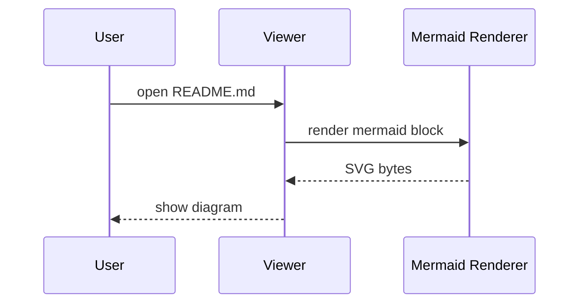

# Mermaid demo

通常の段落です。

```mermaid
flowchart LR
    A[Open Markdown] --> B{Fence is mermaid?}
    B -->|yes| C[Render SVG in Rust]
    B -->|no| D[Show as code block]
    C --> E[Display via GPUI svg()]
```


